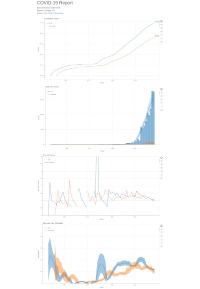

# COVID-19 Case Rate Tracking

This repository is a COVID-19 tracker that performs some extra analysis on top
of the existing, published case data.  The tracker currently uses the
publically-available John Hopkins CSSE
[COVID-19 dataset](https://github.com/CSSEGISandData/COVID-19).

## First, a disclaimer.

I'm not an epidemiologist and I'm not a medical doctor.  Nothing in this repo
can, or should, be considered "expert advice".  My formal background (PhD) is in
signal processing and computer vision.  This project is my way of understanding
what's going on with the outbreak.

Please refer to your relevant national health authorities for up-to-date
information.  I happen to be Canadian so a lot of the documentation will be
somewhat Canada-centric.

Some links:

 * [Public Health Agency of Canada](https://www.canada.ca/en/public-health/services/diseases/coronavirus-disease-covid-19.html)
 * [US Centres for Disease Control and Prevention](https://www.cdc.gov/coronavirus/2019-nCoV/index.html)
 * [World Health Organization](https://www.who.int/emergencies/diseases/novel-coronavirus-2019)

Finally, this is still a work-in-progress.

## Why build yet another COVID-19 tracker?

There are a few different trackers out there, such as, in no particular order:

 * [JHU's Coronavirus Dashboard](https://systems.jhu.edu/research/public-health/ncov/)
 * [Our World in Data's Statistics and Research](https://ourworldindata.org/coronavirus)
 * [COVID19info.live](https://covid19info.live/)

However, these are, for the most part, reporting the raw case counts.  This is
useful information but can miss some important context.  This includes things
like the lag-time inherent to the testing.

For example, assume that a COVID-19 test takes between one to three days to get
a result (postive *or* negative).  Let's also assume that the *true* number of
confirmed cases looks like this, where doubling takes two days:

|   Day     | 1 | 2 | 3 | 4 | 5 | 6 | 7 | 8 |
|-----------|---|---|---|---|---|---|---|---|
| **Count** | 1 | 1 | 2 | 2 | 4 | 4 | 8 | 8 |
| **New**   | 1 | 0 | 1 | 0 | 2 | 0 | 4 | 0 |

However, if it takes a test between one to three days to get a result, then what
you observe will be:

|   Day     | 1 | 2 | 3 | 4 | 5 | 6 | 7 | 8 | 9 |
|-----------|---|---|---|---|---|---|---|---|---|
| **Count** | 0 | 1 | 1 | 1 | 1 | 4 | 4 | 6 | 8 |
| **New**   | 0 | 1 | 0 | 0 | 0 | 4 | 0 | 2 | 2 |

There appears to be a spike of four cases on day '6', even though the growth
rate hasn't changed.  Basically, you need to look at the number of cases over
the *expected* lag in order to get a true sense of where things are.  Otherwise,
you have an extended period where things look stable but actually aren't.

A lot of this was inspired by these two YouTube videos:

<a href="http://www.youtube.com/watch?feature=player_embedded&v=Kas0tIxDvrg
" target="_blank"></a>

<a href="http://www.youtube.com/watch?feature=player_embedded&v=fgBla7RepXU
" target="_blank"></a>

They provide a good overview of the underlying mathematics behind an outbreak
and exponential growth in general.  And for some more general medical context:

<a href="http://www.youtube.com/watch?feature=player_embedded&v=ofSLpDQx1bA
" target="_blank"></a>

## Using the tool

The best way to set up the development environment is with
[Conda](https://conda.io/en/latest/):

```bash
$ conda env create
```

That will ensure that you're using the correct version of Python.  However, the
packaging doesn't depend on Conda, so, alternatively, you can use:

```bash
$ pip install .
```

The `download` command is used to fetch the latest version of the JHU dataset:

```bash
$ covid19 download
$ covid19 info -c Canada
COVID-19 Case Rates
--
Dataset Path: covid19_repo
Available Reports: 55
Country: Canada
First: 2020-01-26
  - Confirmed: 1
  - Recovered: 0
Last:  2020-03-20
  - Confirmed: 943
  - Recovered: 9
```

Finally, you can generate an HTML report with `report`, e.g.:

```
$ covid19 report -c Canada -c US
```

This will produce an HTML report similar to the image below.


